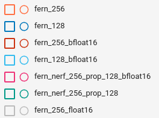
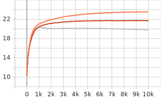
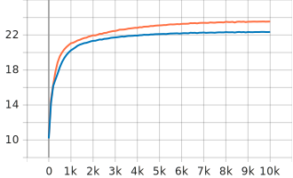
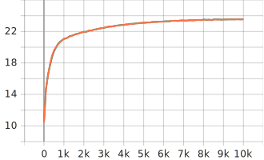

# fern tests
## reasoning:
The llff fern scene was trained to 10k iterations on a 3090 to:
1. demonstrate impact of dtype (float32, float16 and bfloat16) change on psnr
2. demonstrate impact of 256 vs. 128 width for both MLPs
3. demonstrate impact of 256 vs. 128 width for just density (prop) MLP
4. show the impact on training speed of these tweaks

## results:

1. **dtype**: bfloat16: -10%, float16: -20%

2. **MLP width**: 128: -10%

3. **prop 128**: prop width 128: no change!

4**training speed**: bfloat16 @ 128: >3x faster than f32 @256

